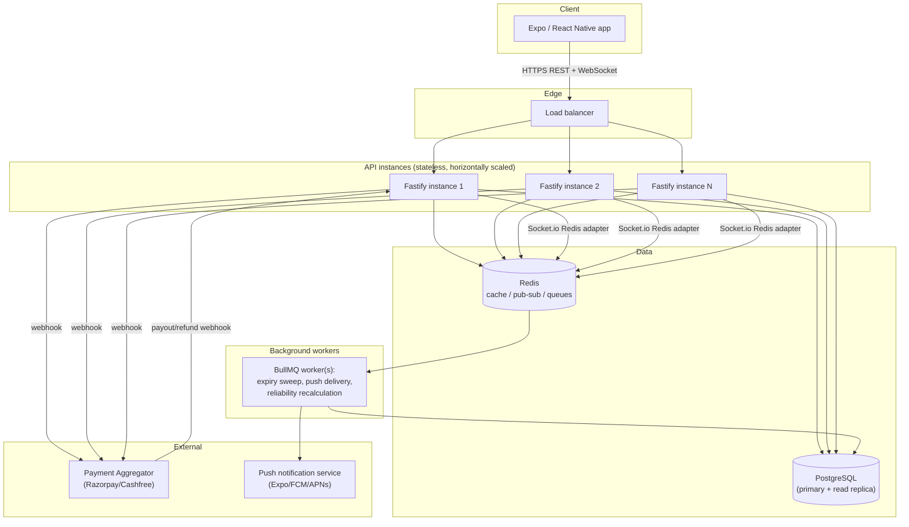

# CampusCart — Production Build Specification

**Purpose of this file:** hand this to Claude Code (or any coding agent/dev
team with normal internet access) as the brief for building CampusCart as a
real, production-grade, multi-tenant-capable app. It assumes full package
registry access — unlike the reference implementation this project already
has, which was deliberately built with **zero external dependencies**
because it was written in a sandbox with no npm/pip access at all.

**Do not throw the reference implementation away.** It already contains
correct, tested business logic (matching algorithm, cost splitting, UPI
link generation, reliability scoring, threshold tracking) verified by 22
passing checks against a real HTTP server and real SQLite database. Port
that logic into the stack below; don't re-derive it from scratch.

Reference implementation location: `backend/` and `mobile/` in this same
project. Product concept: `CampusCart_Group_Ordering_Concept.cd` /
`.md`. Read both before writing code.

---

## 1. What this app does (one paragraph)

Blinkit enforces a ₹150 minimum order. CampusCart lets nearby students on
one campus combine small orders into a single group order that crosses
₹150, splits the cost back to each person by what they actually added, and
has one student ("the coordinator") place the real Blinkit order and
collect everyone else's share directly over UPI. CampusCart never places
the Blinkit order itself (no such API exists — confirmed) and never
custodies money (no RBI Payment Aggregator license — see §7).

---

## 2. Target scale & non-functional requirements

Design for **one university's active population** as the baseline, with a
clear path to more:

- 5,000–20,000 concurrent registered users per campus deployment
- Low hundreds of concurrent active group orders at peak (meal times)
- p95 API latency < 200ms for reads, < 500ms for writes
- Realtime group updates delivered within ~1s of the triggering action
- Horizontally scalable: adding a second API instance must require zero
  code changes — no in-memory state that isn't safe to duplicate
- Zero data loss on a single instance crash (all state in Postgres/Redis,
  never only in process memory)
- 99.5%+ uptime target for a production deployment

---

## 3. Tech stack (production)

| Layer | Choice | Why |
|---|---|---|
| Language | TypeScript everywhere | one type system across API and app |
| API framework | **Fastify** (or Express if the team prefers familiarity) | Fastify: built-in schema validation, better throughput than Express at scale |
| ORM | **Prisma** | type-safe queries, migrations, works great with Postgres |
| Database | **PostgreSQL 16** (managed: RDS / Neon / Supabase / Render Postgres) | relational integrity for money + group membership matters here |
| Cache / pub-sub / queues | **Redis** (managed: Upstash / ElastiCache) | rate limiting, Socket.io adapter, BullMQ backing store |
| Realtime | **Socket.io** with `@socket.io/redis-adapter` | multi-instance-safe realtime group updates (replaces the reference app's single-process SSE) |
| Background jobs | **BullMQ** (Redis-backed) | group-expiry sweeps, push notification delivery, reliability recalculation — replaces the reference app's in-process `setInterval` |
| Auth | JWT access (15 min) + refresh (30 days) via `jose` or `fast-jwt`, password hashing via `argon2` | argon2 is the current OWASP-preferred KDF, stronger than scrypt/bcrypt at equal settings |
| Validation | **Zod** (or Fastify's built-in JSON Schema) | shared schemas between API and mobile types |
| Payments | UPI deep links for MVP; **Razorpay Route + Payouts** (or Cashfree equivalent) for the production payment path — see §7 | keeps CampusCart out of RBI Payment Aggregator territory either way |
| Push notifications | **Expo push notifications** (mobile is Expo) or FCM/APNs directly if you eject | needed for real "your group is ready" alerts |
| Mobile app | **Expo / React Native + TypeScript** | already the reference stack; add: |
| — data fetching/cache | **TanStack Query (React Query)** | request dedup, cache invalidation, replaces the reference app's manual polling |
| — state | **Zustand** for local UI state; server state lives in React Query | avoid a heavier Redux setup for what's mostly server state |
| — styling | **NativeWind** (Tailwind for React Native) or `react-native-paper` for a ready component set | consistent design tokens across every screen |
| — forms | **React Hook Form + Zod resolver** | consistent client-side validation matching the API's schemas |
| Logging | **Pino** (structured JSON logs) | pairs natively with Fastify |
| Error tracking | **Sentry** (both backend and mobile) | crash reporting + performance tracing |
| Testing (backend) | **Vitest** + **Supertest** | fast, TS-native |
| Testing (mobile) | **Jest** + **React Native Testing Library**; **Detox** for e2e if budget allows | |
| Load testing | **k6** | scriptable, good CI integration |
| CI/CD | **GitHub Actions** | lint → typecheck → test → build → deploy |
| Containerization | **Docker** (multi-stage build — the reference app already has one to adapt) | |
| Hosting (backend) | Render / Railway / Fly.io for a campus-scale deployment; AWS ECS+RDS+ElastiCache if it needs to grow beyond that | |
| Hosting (mobile) | Expo EAS Build + EAS Update | OTA updates without app-store review for JS-only changes |
| Secrets management | Provider's built-in env var storage (Render/Railway/Fly secrets) or Doppler if managing multiple environments | never commit secrets, never bake them into the Docker image |

---

## 4. Architecture



Key differences from the reference implementation, and why:

| Reference app (sandbox-constrained) | Production spec | Reason |
|---|---|---|
| `node:sqlite`, single file | PostgreSQL, managed, with a read replica once read load justifies it | concurrent writers, backups, connection pooling, horizontal API scaling |
| In-process SSE (`src/realtime.ts`) | Socket.io + Redis adapter | SSE subscriber lists live in one process's memory — breaks the moment you run 2 API instances |
| In-process `setInterval` for expiry (`src/jobs/expiry.ts`) | BullMQ repeatable job | same problem — an in-memory timer only runs on whichever instance happens to have it; a queue guarantees exactly-once-ish delivery across instances |
| In-memory per-IP rate limiter (`src/http.ts`) | Redis-backed rate limiter (`@fastify/rate-limit` with a Redis store) | per-instance memory means a user could get 120 req/min × N instances instead of 120 total |
| Self-reported payment status | Payment aggregator webhook (signature-verified) as the source of truth | never trust the client to say money moved |
| Hand-rolled JWT / scrypt | Battle-tested libraries (`jose`, `argon2`) | no reason to hand-maintain crypto once real dependencies are available |

---

## 5. Data model

Start from the reference Prisma-shaped schema (the reference app's
`src/types.ts` + raw SQL in `src/db.ts` show the exact shape already
validated) and extend it:

```prisma
// New/changed vs. the reference implementation:

model GroupOrder {
  // ...all existing fields...
  deliveryFeePaise   Int      @default(0)   // NEW — split this too, don't ignore it
  actualTotalPaise   Int?                    // NEW — filled in after the real order is placed, for reconciliation
  proofImageUrl      String?                 // NEW — coordinator's screenshot of the Blinkit confirmation
}

model Contribution {
  // ...all existing fields...
  paymentGatewayRef  String?   // NEW — the PA's payment id, once you're on Option B (see §7)
  verifiedByWebhook  Boolean  @default(false) // NEW — true only once the PA's webhook confirms it, never set by client action alone
}

model Dispute {                 // NEW
  id           String   @id @default(cuid())
  groupOrderId String
  raisedBy     String
  reason       String
  status       String   // OPEN | RESOLVED | REJECTED
  createdAt    DateTime @default(now())
  resolvedAt   DateTime?
}

model PushToken {               // NEW
  id        String   @id @default(cuid())
  userId    String
  token     String   @unique   // Expo push token
  platform  String              // ios | android
  createdAt DateTime @default(now())
}

model AuditLog {                // NEW — every money-affecting or auth-affecting action, append-only
  id        String   @id @default(cuid())
  userId    String?
  action    String              // e.g. "coordinator.claim", "payment.confirmed", "login.failed"
  metadata  Json
  ip        String?
  createdAt DateTime @default(now())
}
```

Keep everything else — `User`, `Hostel`, `GroupItem`, `ReliabilityEvent`,
`Notification` — structurally as the reference app defines them. Money
stays integer paise everywhere; that convention doesn't change with scale.

---

## 6. API surface

Same routes as the reference implementation (`backend/src/routes/*.ts`),
migrated to Fastify with Zod/JSON-Schema request+response validation on
every route. Additions for production:

- `POST /groups/:id/dispute` — raise a dispute (coordinator collected
  money, never ordered; wrong items delivered; etc.)
- `PATCH /admin/disputes/:id` — admin resolves a dispute (requires an
  admin role — see §7 RBAC)
- `POST /push/register` — register an Expo push token for the current user
- `POST /webhooks/payment` — signature-verified webhook from the payment
  aggregator (Option B, §7); this is what actually flips a contribution to
  `PAID`, not the client
- `GET /health` and `GET /ready` — liveness vs. readiness probes (readiness
  checks DB + Redis connectivity, for your orchestrator/load balancer)

Every route needs, at minimum: Zod-validated body/query, auth middleware
where required, and a rate limit tier (stricter on `/auth/*`, looser on
reads).

---

## 7. Security requirements (non-negotiable)

**Auth & sessions**
- Argon2id for password hashing (OWASP-recommended parameters: memory
  cost ≥ 19 MiB, iterations ≥ 2)
- Short-lived access tokens (15 min), refresh token rotation (issue a new
  refresh token on every use, invalidate the old one — detect reuse as a
  signal of a stolen token)
- Refresh tokens stored server-side (hashed) so they can be revoked
  (logout-everywhere, compromised-account response)
- Mobile stores tokens in `expo-secure-store` only, never AsyncStorage

**Transport & headers**
- HTTPS everywhere, HSTS enabled
- `@fastify/helmet` for security headers
- CORS allowlist, never `*` in production
- CSRF is not applicable to a token-bearer mobile API, but any future admin
  web dashboard needs it

**Input handling**
- Every request body/query validated against a schema before touching
  business logic — reject, don't sanitize-and-hope
- Parameterized queries only (Prisma gives you this by default — don't
  drop to raw SQL without parameter binding)
- File uploads (dispute evidence, proof-of-order screenshots) go through
  size limits, content-type allowlisting, and a virus scan step (e.g.
  ClamAV in the upload pipeline) before being stored (S3/R2/Cloudinary,
  never on the API instance's local disk)

**Rate limiting & abuse prevention**
- Redis-backed, per-user AND per-IP, stricter on `/auth/*` (prevents
  credential stuffing) than on reads
- Account lockout / exponential backoff after repeated failed logins

**Payments (the part that needs the most care)**
- CampusCart must **never** hold customer funds. Two valid architectures,
  same as the concept doc / reference README:
  - **Option A (peer-to-peer UPI):** what the reference app implements.
    Fine indefinitely at any scale — CampusCart only ever generates a
    `upi://pay` deep link; money moves bank-to-bank between the paying
    student and the coordinator, never through CampusCart. No RBI PA
    license is triggered because CampusCart never custodies funds.
  - **Option B (licensed aggregator, for stronger guarantees):** route
    through an RBI-authorized Payment Aggregator (Razorpay/Cashfree).
    Students pay into the aggregator's escrow; CampusCart triggers a
    single payout to the coordinator once the threshold is hit; failed
    groups get automatic refunds via the aggregator's API. **The
    aggregator's signed webhook — not the mobile client — is the only
    thing allowed to mark a `Contribution` as `PAID`.** Verify the webhook
    signature on every call; treat an unsigned or badly-signed webhook as
    an attack, not a bug.
  - Either way: CampusCart's servers must never see a card number, CVV,
    or UPI PIN. If you ever find yourself building a form field for one
    of those, stop — that's the wrong architecture.

**RBAC**
- Three roles minimum: `student` (default), `coordinator` (a group-scoped
  role, not global — anyone can become one per group), `admin` (dispute
  resolution, abuse response). Enforce role checks server-side on every
  privileged route, never trust a client-supplied role claim without
  re-verifying against the DB.

**Auditability**
- Every money-affecting action (coordinator claimed, payment confirmed,
  order completed, dispute raised/resolved) writes an `AuditLog` row.
  This is what you'll actually need when a student disputes "I paid and
  they say I didn't."

**Dependency & supply-chain hygiene**
- `npm audit` / Dependabot / Snyk in CI, failing the build on high/critical
  vulnerabilities
- Pin exact versions in production; review before bumping majors

**Secrets**
- Real secrets generated with `openssl rand -hex 32`, stored in your
  host's secret manager, never in `.env` files committed to git, never
  baked into a Docker image layer

---

## 8. Realtime & background work

- Replace the reference app's SSE with **Socket.io + `@socket.io/redis-adapter`**
  so a group-order update broadcast from any API instance reaches a
  client connected to any other instance.
- Replace the reference app's `setInterval` expiry sweep with a **BullMQ
  repeatable job** (e.g. every 15s, same cadence) that any one worker
  process picks up — this is what makes expiry correct once you run more
  than one process.
- Reliability score recalculation, push notification delivery, and any
  future "popularity prediction" batch job also belong in BullMQ, not
  inline in the request path — keep API response times fast by pushing
  slow/non-critical work into a queue.

---

## 9. Mobile app — production UI/UX bar

The reference app's screens (`mobile/src/screens/*.tsx`) are functionally
complete but intentionally minimal. For a production release, raise:

- **Design system:** define tokens (spacing scale, type scale, color
  roles including a real dark mode, not just default React Native
  styling) once, consume everywhere — don't hand-roll `StyleSheet.create`
  literals per screen as the reference app does.
- **Loading, empty, and error states** for every screen — the reference
  app has bare-minimum handling; production needs skeleton loaders,
  friendly empty states ("no groups near you yet — start one"), and
  retry affordances on network failure.
- **Optimistic UI** for actions like "I've paid" via React Query mutations
  — don't make the user stare at a spinner for a round trip that will
  almost always succeed.
- **Accessibility:** proper `accessibilityLabel`s, minimum touch target
  size (44×44pt), color contrast passing WCAG AA, screen-reader-friendly
  progress indication for the threshold bar (don't rely on color alone).
- **Real push notifications** (Expo push) replacing the reference app's
  3-second polling — polling is fine for a hackathon demo, not for a
  battery-conscious production app.
- **Offline handling:** at minimum, a clear "you're offline" state; ideally
  queue "I've paid" / item-add actions to retry on reconnect.

---

## 10. Testing & quality gates (CI pipeline)

1. Lint + typecheck (`tsc --noEmit`) on every PR
2. Unit tests for all pure business logic — the reference app's
   `src/lib/*.ts` (matching, splitting, UPI links, reliability) already
   has these; port them as-is, they're stack-agnostic
3. Integration tests (Supertest against a real Postgres test database,
   e.g. via `testcontainers`) covering the same flow the reference app's
   `tests/run.ts` already proves end-to-end: signup → create group →
   match → join → cross threshold → claim coordinator → pay → complete
4. Contract tests or shared Zod schemas so backend and mobile can't drift
5. Load test (k6) hitting `/groups/matches` and `/groups/:id` — the two
   hottest read paths — at your target concurrent-user number before
   every major release
6. Mobile: component tests for screens with business logic (threshold
   math, split display), Detox e2e for the critical path if resourced

A build that fails any of these does not deploy — wire this as required
GitHub Actions checks before merge.

---

## 11. Observability

- Structured JSON logs (Pino) shipped to your host's log aggregation
  (Render/Railway built-in, or a dedicated ELK/Datadog if you outgrow that)
- Sentry on both backend and mobile for error tracking + release health
- A `/ready` endpoint your load balancer actually uses for health checks
  (checks DB + Redis, not just "process is alive")
- Basic metrics dashboard: request rate, error rate, p50/p95/p99 latency,
  queue depth (BullMQ), active Socket.io connections — Grafana Cloud's
  free tier or your host's built-in metrics are enough at this scale

---

## 12. Migration plan (suggested milestones)

1. **Parity migration** — reimplement the reference app's exact business
   logic and API surface on Fastify + Prisma + Postgres, keeping SQLite's
   schema shape. Port `tests/run.ts`'s scenario as your integration test.
   Ship this behind the same mobile app (just point `EXPO_PUBLIC_API_URL`
   at it) before adding anything new.
2. **Realtime & background jobs** — swap SSE for Socket.io+Redis, swap the
   `setInterval` expiry sweep for BullMQ.
3. **Security hardening** — Redis-backed rate limiting, argon2, refresh
   token rotation + revocation, audit log, RBAC for admin/dispute routes.
4. **Payments Option B** — integrate Razorpay/Cashfree Route + Payouts,
   webhook signature verification, automatic refunds on expiry.
5. **Mobile polish** — design system, React Query, real push notifications,
   accessibility pass.
6. **Load test & launch** — k6 against target concurrency, fix what falls
   over, then open it up to the campus.

Each milestone should be independently deployable and demo-able — don't
big-bang this.

---

## 13. What NOT to build (stay lazy about the rest)

- No microservices split for a single-campus app at this scale — one
  well-structured API service is correct; don't add Kubernetes/service
  mesh complexity you don't need yet.
- No custom ORM, custom job queue, or custom WebSocket protocol — Prisma,
  BullMQ, and Socket.io are the boring, correct choices; don't reinvent
  them.
- No ML-based matching yet — the reference app's rule-based match score
  is exactly what the product concept calls for until there's usage data
  to train on.
- No support for stores other than Blinkit, and no automated Blinkit
  ordering — both are explicitly out of scope; see §1 and the concept
  doc's "Important Integration Constraint" section.
